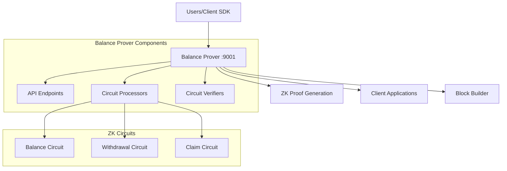
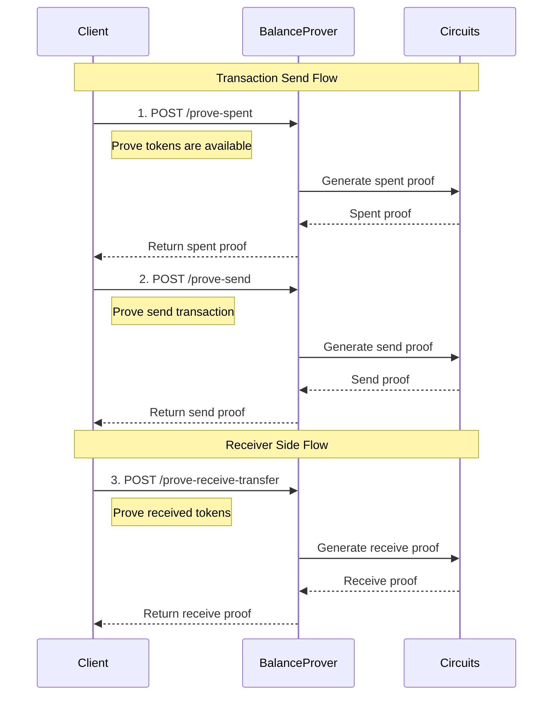

# Balance Prover

The Balance Prover is a stateless client-side zero-knowledge proof generation service in the INTMAX2 network. It operates on port 9001 and provides cryptographic proof generation capabilities for various user operations, enabling privacy-preserving transactions and state updates.

## Overview

The Balance Prover is responsible for generating zero-knowledge proofs that validate user operations without revealing sensitive information. As a stateless service, it doesn't maintain any persistent data and focuses purely on cryptographic computations.

## Architecture



## API Endpoints

The Balance Prover provides seven main proof generation endpoints:

### POST /prove-spent

Generates a proof that tokens have been spent (first step in send transactions).

**Request:**

```json
{
  "spent_witness": {
    /* spent witness data */
  }
}
```

**Response:**

```json
{
  "proof": {
    /* ZK proof data */
  }
}
```

### POST /prove-send

Generates a proof for sending tokens to another user.

**Request:**

```json
{
  "pubkey": "0x...",
  "tx_witness": {
    /* transaction witness */
  },
  "update_witness": {
    /* state update witness */
  },
  "spent_proof": {
    /* proof from prove-spent */
  },
  "prev_proof": {
    /* optional previous proof */
  }
}
```

**Response:**

```json
{
  "proof": {
    /* ZK proof data */
  }
}
```

### POST /prove-update

Generates a proof for updating user state without transactions.

**Request:**

```json
{
  "pubkey": "0x...",
  "update_witness": {
    /* update witness data */
  },
  "prev_proof": {
    /* optional previous proof */
  }
}
```

**Response:**

```json
{
  "proof": {
    /* ZK proof data */
  }
}
```

### POST /prove-receive-transfer

Generates a proof for receiving tokens from another user.

**Request:**

```json
{
  "pubkey": "0x...",
  "receive_transfer_witness": {
    /* receive witness data */
  },
  "prev_proof": {
    /* optional previous proof */
  }
}
```

**Response:**

```json
{
  "proof": {
    /* ZK proof data */
  }
}
```

### POST /prove-receive-deposit

Generates a proof for receiving deposited tokens from L1.

**Request:**

```json
{
  "pubkey": "0x...",
  "receive_deposit_witness": {
    /* deposit witness data */
  },
  "prev_proof": {
    /* optional previous proof */
  }
}
```

**Response:**

```json
{
  "proof": {
    /* ZK proof data */
  }
}
```

### POST /prove-single-withdrawal

Generates a proof for withdrawing tokens to L1.

**Request:**

```json
{
  "withdrawal_witness": {
    /* withdrawal witness data */
  }
}
```

**Response:**

```json
{
  "proof": {
    /* ZK proof data */
  }
}
```

### POST /prove-single-claim

Generates a proof for claiming tokens (with optional faster mining).

**Request:**

```json
{
  "is_faster_mining": false,
  "claim_witness": {
    /* claim witness data */
  }
}
```

**Response:**

```json
{
  "proof": {
    /* ZK proof data */
  }
}
```

## Proof Generation Flow



## ZK Circuit Types

### 1. Balance Circuit

- **Purpose**: Manages user balance state transitions
- **Operations**: Send, receive, update balance states
- **Input**: Previous proof, witness data, public keys
- **Output**: New balance proof with updated state

### 2. Withdrawal Circuit

- **Purpose**: Validates withdrawals from L2 to L1
- **Operations**: Single withdrawal transactions
- **Input**: Withdrawal witness, balance proof
- **Output**: Withdrawal proof for L1 submission

### 3. Claim Circuit

- **Purpose**: Validates token claiming operations
- **Variants**:
  - Normal claim (standard lock time)
  - Faster claim (reduced lock time with higher requirements)
- **Input**: Claim witness, validity proof
- **Output**: Claim proof for execution

## Technical Details

### Circuit Verifiers

The Balance Prover loads pre-built circuit verifiers:

- **Validity Verifier**: Validates on-chain state proofs
- **Balance Verifier**: Validates balance state transitions
- **Withdrawal Verifier**: Validates withdrawal operations
- **Claim Verifier**: Validates claim operations

### Proof Chaining

Many operations support **proof chaining** where previous proofs are used as inputs:

- Enables complex multi-step operations
- Maintains privacy across operation sequences
- Reduces on-chain verification costs

### Performance Characteristics

- **Stateless**: No setup or teardown overhead
- **Concurrent**: Multiple proof generations can run in parallel
- **Memory-efficient**: Circuits are loaded once and reused

## Environment Configuration

Basic configuration (see `.env.example`):

```bash
# Server Configuration
PORT=9001
ENV=local
```

The Balance Prover requires minimal configuration as it's designed to be stateless and self-contained.
