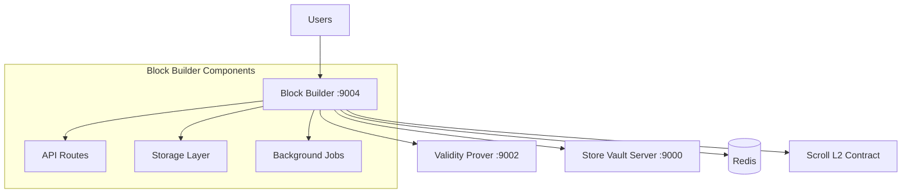
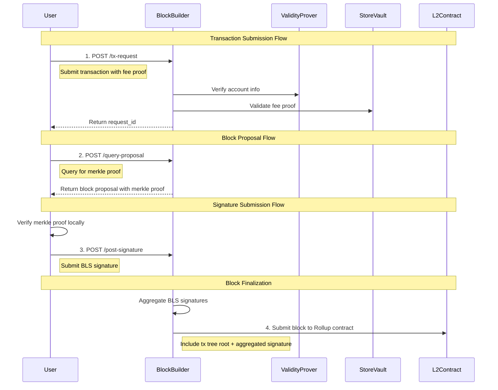
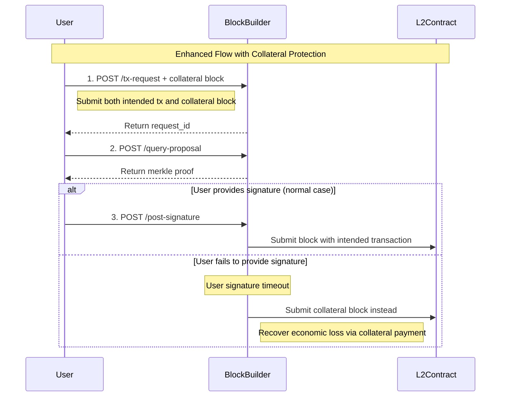
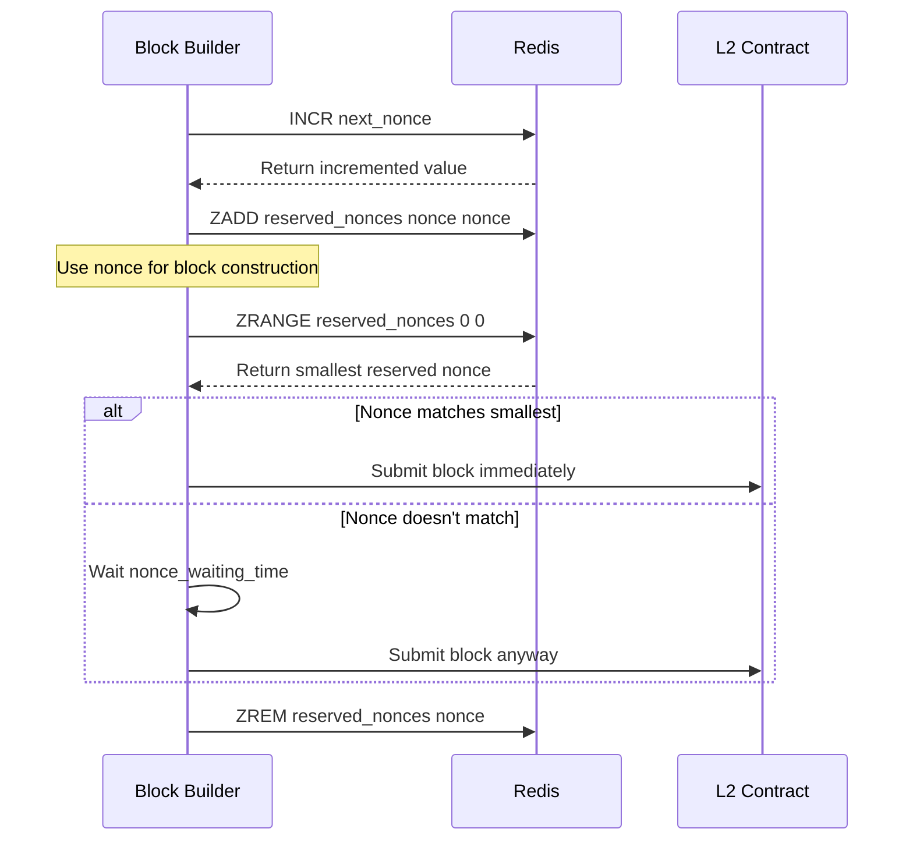

# Block Builder

The Block Builder is a core service in the INTMAX2 network that collects user transactions, constructs blocks, and submits them to the Rollup contract on Scroll L2. It operates on port 9004 and serves as the central coordinator for transaction processing and block construction.

## Overview

The Block Builder follows a specific workflow to collect transactions, build blocks, and submit them to the blockchain:

1. **Transaction Collection**: Receives transactions from users and constructs a transaction merkle tree
2. **Proof Distribution**: Provides merkle proofs to users for their submitted transactions
3. **Signature Collection**: Collects BLS signatures from users after they verify their merkle proofs
4. **Block Submission**: Aggregates BLS signatures and submits the block with the transaction tree root to the Scroll Rollup contract

## Architecture



## API Flow



## API Endpoints

### GET /fee-info

Returns fee information and block builder configuration.

**Response:**

```json
{
  "version": "0.1.0",
  "block_builder_address": "0x...",
  "beneficiary": "intmax1...",
  "registration_fee": [{ "token_index": 0, "amount": "25" }],
  "non_registration_fee": [{ "token_index": 0, "amount": "20" }],
  "registration_collateral_fee": null,
  "non_registration_collateral_fee": null
}
```

### POST /tx-request

Submits a transaction request to be included in the next block.

**Request:**

```json
{
  "is_registration_block": false,
  "sender": "intmax1...",
  "tx": {
    /* transaction data */
  },
  "fee_proof": {
    /* optional fee proof */
  }
}
```

**Response:**

```json
{
  "request_id": "uuid-string"
}
```

### POST /query-proposal

Queries the block proposal containing the merkle proof for a submitted transaction.

**Request:**

```json
{
  "request_id": "uuid-string"
}
```

**Response:**

```json
{
  "block_proposal": {
    "merkle_proof": {
      /* proof data */
    },
    "block_hash": "0x..."
    /* additional proposal data */
  }
}
```

### POST /post-signature

Submits a BLS signature after verifying the merkle proof.

**Request:**

```json
{
  "request_id": "uuid-string",
  "pubkey": [
    /* BLS public key */
  ],
  "signature": [
    /* BLS signature */
  ]
}
```

## Block Types

### 1. Registration Block

- **Purpose**: For users not yet registered in the account tree
- **Content**: Contains 32-byte BLS public keys of senders
- **Effect**: Registers senders in the account tree after block submission
- **Cost**: Higher transaction fees

### 2. Non-Registration Block

- **Purpose**: For users already registered in the account tree
- **Content**: Contains 5-byte account IDs (indices in the account tree)
- **Effect**: Processes transactions for existing accounts
- **Cost**: Lower transaction fees (more economical)

### 3. Collateral Block

Collateral blocks are a risk mitigation mechanism that protects block builders from economic losses when users fail to provide signatures after submitting transaction requests.

#### Problem

When a user submits a transaction request (`POST /tx-request`) but fails to return the required BLS signature (`POST /post-signature`), the block builder faces an economic loss:

- The user's transaction consumes block space
- The block builder cannot collect transaction fees from the user
- Block space that could have been used by paying customers is wasted

#### Solution: Collateral Mechanism

To mitigate this risk, block builders can require users to submit **collateral blocks** along with their transaction requests:

1. **Collateral Block Structure**: A pre-signed, complete block containing:

   - A transaction that sends payment directly to the block builder
   - The user's BLS signature (already included)
   - The same nonce as the user's intended transaction

2. **Nonce Conflict**: Since both the collateral transaction and the user's intended transaction use the same nonce, only one can be executed on-chain

3. **Economic Guarantee**:
   - If the user provides their signature normally → intended transaction is processed
   - If the user fails to provide signature → block builder submits the collateral block to recover losses

#### Flow with Collateral



#### Configuration

Collateral requirements can be configured via environment variables:

- `REGISTRATION_COLLATERAL_FEE`: Collateral amount for registration blocks
- `NON_REGISTRATION_COLLATERAL_FEE`: Collateral amount for non-registration blocks

## Deposit Synchronization

The Block Builder handles deposit synchronization with special considerations:

- **Deposit Reflection**: Deposits can only be reflected in the INTMAX2 network after the deposit tree is updated and the next block is submitted
- **Testnet Behavior**: In low-activity networks (like testnets), empty blocks are automatically submitted whenever deposits are detected
- **Configuration**: Set `DEPOSIT_CHECK_INTERVAL` environment variable to enable automatic empty block submission for deposit synchronization

## Redis Data Structure and Data Flow

The Block Builder uses Redis as its primary storage backend for managing transaction queues, block proposals, signatures, and background tasks. Redis provides distributed coordination between multiple Block Builder instances and ensures data persistence.

### Redis Key Structure

All Redis keys use a hierarchical naming convention with cluster-based prefixes:

```
block_builder:{cluster_id}:{key_type}:{specific_identifier}
```

#### Core Data Keys

| Key Pattern                                   | Type   | Purpose                                             | TTL   |
| --------------------------------------------- | ------ | --------------------------------------------------- | ----- |
| `{prefix}:registration_tx_requests`           | List   | Queue of registration transaction requests          | 20min |
| `{prefix}:non_registration_tx_requests`       | List   | Queue of non-registration transaction requests      | 20min |
| `{prefix}:registration_tx_last_processed`     | String | Timestamp of last registration batch processing     | 20min |
| `{prefix}:non_registration_tx_last_processed` | String | Timestamp of last non-registration batch processing | 20min |
| `{prefix}:request_id_to_block_id`             | Hash   | Maps transaction request IDs to block IDs           | 20min |
| `{prefix}:memos`                              | Hash   | Stores block proposal memos by block ID             | 20min |
| `{prefix}:signatures:{block_id}`              | List   | User signatures for specific block                  | 20min |
| `{prefix}:empty_block_posted_at`              | String | Timestamp of last empty block submission            | 20min |

#### Task Queue Keys

| Key Pattern                     | Type | Purpose                           | TTL   |
| ------------------------------- | ---- | --------------------------------- | ----- |
| `{prefix}:fee_collection_tasks` | List | Queue of fee collection tasks     | 20min |
| `{prefix}:block_post_tasks_hi`  | List | High-priority block posting queue | 20min |
| `{prefix}:block_post_tasks_lo`  | List | Low-priority block posting queue  | 20min |

#### Nonce Management Keys

| Key Pattern                                 | Type       | Purpose                                          |
| ------------------------------------------- | ---------- | ------------------------------------------------ |
| `{prefix}:next_registration_nonce`          | String     | Next available registration nonce                |
| `{prefix}:next_non_registration_nonce`      | String     | Next available non-registration nonce            |
| `{prefix}:reserved_registration_nonces`     | Sorted Set | Reserved registration nonces (score = nonce)     |
| `{prefix}:reserved_non_registration_nonces` | Sorted Set | Reserved non-registration nonces (score = nonce) |

#### Distributed Lock Keys

| Key Pattern                 | Type   | Purpose                                   | TTL   |
| --------------------------- | ------ | ----------------------------------------- | ----- |
| `{prefix}:lock:{operation}` | String | Distributed locks for critical operations | 10sec |

### Transaction Request Processing

#### 1. Transaction Submission (`add_tx`)

```rust
// Data structure stored in Redis
struct TxRequestWithTimestamp {
    request: TxRequest,
    timestamp: u64,  // Unix timestamp
}
```

- Transactions are queued in separate lists for registration/non-registration
- Each request includes timestamp for timeout handling
- Redis operations: `RPUSH` to queue, `EXPIRE` for TTL

#### 2. Batch Processing (`process_requests`)

```rust
// Generated proposal memo structure
struct ProposalMemo {
    created_at: u64,
    block_id: String,
    block_sign_payload: BlockSignPayload,
    pubkeys: Vec<U256>,            // Sorted & padded pubkeys
    pubkey_hash: Bytes32,          // Hash of sorted pubkeys
    tx_requests: Vec<TxRequest>,   // Original requests
    proposals: Vec<BlockProposal>, // Merkle proofs for each request
}
```

**Processing Logic:**

1. **Distributed Lock**: Acquire `process_{registration|non_registration}_requests` lock
2. **Batch Collection**: Collect up to `NUM_SENDERS_IN_BLOCK` (32) transactions
3. **Timing Control**:
   - Process immediately if queue is full (32 transactions)
   - Wait for `accepting_tx_interval` if queue is partial
4. **Nonce Reservation**: Reserve sequential nonce from nonce manager
5. **Merkle Tree Construction**: Build transaction merkle tree with sorted pubkeys
6. **Atomic Storage**: Store memo, update mappings, remove processed requests

#### 3. Signature Collection (`add_signature`)

- Verify signature against stored memo's `block_sign_payload`
- Store in per-block signature list: `signatures:{block_id}`
- Signatures are deduplicated during processing

#### 4. Block Finalization (`process_signatures`)

**Processing Logic:**

1. **Timing Check**: Process memos older than `proposing_block_interval`
2. **Signature Aggregation**: Collect and deduplicate signatures
3. **Task Creation**: Generate `BlockPostTask` for non-empty signature sets
4. **Priority Queuing**: Add to high-priority queue (`block_post_tasks_hi`)
5. **Fee Collection**: Optionally create fee collection tasks
6. **Cleanup**: Remove processed memos and signatures

### Nonce Management System

The nonce management system ensures sequential block submission while supporting concurrent Block Builder instances.

#### Nonce Reservation Flow



#### On-chain Synchronization

- Periodically sync with L2 contract nonces
- Clean up reserved nonces below on-chain nonce
- Handle nonce gaps from failed transactions

### Block Posting Priority System

#### High Priority Queue (`block_post_tasks_hi`)

- Contains blocks with user signatures
- Processed with nonce ordering consideration
- Immediate submission when nonce matches smallest reserved

#### Low Priority Queue (`block_post_tasks_lo`)

- Contains empty blocks for deposit synchronization
- Contains fee collection result blocks
- Processed with simple FIFO using `BLPOP`

#### Nonce-Aware Dequeuing

```rust
// Dequeue logic prioritizes nonce ordering
if high_priority_task.nonce == smallest_reserved_nonce {
    // Submit immediately
    submit_block(high_priority_task)
} else {
    // Wait then submit to prevent nonce gaps
    sleep(nonce_waiting_time)
    submit_block(high_priority_task)
}
```

### Distributed Coordination

#### Lock-Based Coordination

Critical operations use distributed locks to prevent race conditions:

- `process_registration_requests`: Prevents duplicate processing
- `process_non_registration_requests`: Prevents duplicate processing
- `process_signatures`: Prevents duplicate signature processing
- `process_fee_collection`: Prevents duplicate fee collection
- `enqueue_empty_block`: Prevents duplicate empty blocks

#### Lock Implementation

```rust
// Atomic lock acquisition using Redis SET NX
SET lock_key instance_id NX EX timeout_seconds
```

#### Multi-Instance Safety

- Each Block Builder instance has unique `block_builder_id`
- Locks include instance ID for ownership verification
- Lua scripts ensure atomic lock release
- Lock timeouts prevent deadlocks (10 seconds)

### Fee Collection Integration

When fee collection is enabled (`use_fee: true`):

1. **Fee Task Creation**: Generated during signature processing
2. **Collateral Handling**: Optional collateral block submission
3. **Result Queuing**: Fee collection results added to low-priority queue
4. **Store Vault Integration**: Communicates with Store Vault Server for fee processing

## Environment Configuration

Key environment variables (see `.env.example`):

```bash
# Server Configuration
PORT=9004
BLOCK_BUILDER_URL=<your-block-builder-url>

# Blockchain Configuration
L2_RPC_URL=<scroll-rpc-url>
ROLLUP_CONTRACT_ADDRESS=<rollup-contract-address>
BLOCK_BUILDER_REGISTRY_CONTRACT_ADDRESS=<registry-contract-address>
BLOCK_BUILDER_PRIVATE_KEY=<private-key>

# Service Dependencies
STORE_VAULT_SERVER_BASE_URL=<store-vault-url>
VALIDITY_PROVER_BASE_URL=<validity-prover-url>
REDIS_URL=redis://localhost:6379

# Block Builder Settings
ETH_ALLOWANCE_FOR_BLOCK=0.001
TX_TIMEOUT=80
ACCEPTING_TX_INTERVAL=30
PROPOSING_BLOCK_INTERVAL=30
DEPOSIT_CHECK_INTERVAL=30

# Fee Configuration
REGISTRATION_FEE=0:25
NON_REGISTRATION_FEE=0:20

# Collateral Configuration (optional)
REGISTRATION_COLLATERAL_FEE=0:50
NON_REGISTRATION_COLLATERAL_FEE=0:40

# Redis Configuration
CLUSTER_ID=<cluster-identifier>  # Optional: for multi-cluster deployments
NONCE_WAITING_TIME=5            # Seconds to wait for nonce ordering
```
