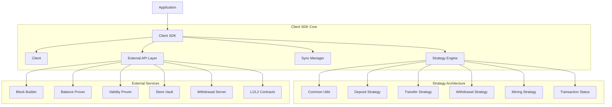

# INTMAX2 Client SDK

## Overview

The Client SDK serves as the primary integration point for applications wanting to leverage INTMAX2's privacy-preserving, stateless Layer 2 protocol. It manages user state, handles cryptographic operations, and coordinates with various INTMAX2 services.

## Architecture



## Strategy Engine

The Strategy Engine determines the sequence to incorporate transactions, deposits, and withdrawals into the user state. It ensures that all operations are processed in a consistent order while maintaining the integrity of user balances.

### Strategy Components

#### 1. **Sequence Determination** (`strategy.rs`)

The core algorithm that determines the processing order for transactions and receipts:

```rust
#[derive(Debug, Clone)]
pub enum Action {
    Receive(Vec<ReceiveAction>),  // Process incoming transfers/deposits
    Tx(MetaDataWithBlockNumber, Box<TxData>),  // Process outgoing transactions
}

#[derive(Debug, Clone)]
pub enum ReceiveAction {
    Deposit(MetaDataWithBlockNumber, DepositData),
    Transfer(MetaDataWithBlockNumber, Box<TransferData>),
}
```

**Key Functions:**

- `determine_sequence()`: Main orchestrator for transaction processing order
- `determine_withdrawals()`: Manages withdrawal request sequencing
- `determine_claims()`: Handles mining reward claim processing

**Processing Logic:**

1. Waits for validity prover to sync with on-chain block number
2. Fetches user data and validates balance sufficiency
3. Processes settled transactions in block order
4. Applies receives before each transaction to maintain balance consistency
5. Validates transaction success using `get_tx_status()`

#### 2. **Data Classification System**

Operations are classified into three states:

```rust
#[derive(Debug, Clone)]
pub struct DepositInfo {
    pub settled: Vec<(MetaDataWithBlockNumber, DepositData)>,
    pub pending: Vec<(MetaData, DepositData)>,
    pub timeout: Vec<(MetaData, DepositData)>,
}
```

- **Settled**: Confirmed on blockchain with block numbers
- **Pending**: Submitted but not yet confirmed on L2
- **Timeout**: Expired transactions based on timestamp + timeout

#### 3. **Balance Management Strategy**

```rust
impl ReceiveAction {
    pub fn apply_to_balances(&self, balances: &mut Balances) {
        match self {
            ReceiveAction::Deposit(_, data) => balances.add_deposit(data),
            ReceiveAction::Transfer(_, data) => balances.add_transfer(data),
        }
    }
}
```

### Deposit Strategy (`deposit.rs`)

Handles deposit data processing and classification:

```rust
#[derive(Debug, Clone)]
pub struct DepositInfo {
    pub settled: Vec<(MetaDataWithBlockNumber, DepositData)>,
    pub pending: Vec<(MetaData, DepositData)>,
    pub timeout: Vec<(MetaData, DepositData)>,
}
```

**Core Processing:**

1. **Batch Fetching**: Uses `get_deposit_info_batch()` for efficient deposit info retrieval
2. **Settlement Check**: Deposits with `block_number` are settled
3. **Liquidity Validation**: Checks `liquidity_contract.check_if_deposit_exists()` for pending deposits
4. **Token Index Assignment**: Sets `token_index` from validity prover information

### Mining Strategy (`mining.rs`)

The mining system allows users to earn rewards by depositing liquidity:

```rust
#[derive(Debug, Clone)]
pub struct Mining {
    pub meta: MetaData,
    pub deposit_data: DepositData,
    pub block: Option<Block>,        // First block containing the deposit
    pub maturity: Option<u64>,       // Maturity unix timestamp
    pub status: MiningStatus,
}

#[derive(Debug, Clone, PartialEq)]
pub enum MiningStatus {
    Pending,        // Pending, not yet processed
    Disqualified,   // Disqualified because there is a send tx before the maturity
    Locking,        // In locking period
    Claimable(u32), // Claimable with the block number at the time of claim
}
```

**Mining Process:**

1. **Deposit Filtering**: Only eligible deposits (`is_eligible: true`) are considered
2. **Criteria Validation**: Uses `validate_mining_deposit_criteria()` for amount/token checks
3. **Lock Configuration**: `LockTimeConfig::normal()` or `LockTimeConfig::faster()`
4. **Disqualification**: Sending transactions before maturity disqualifies mining rewards

### Transfer Strategy (`transfer.rs`)

Handles encrypted transfer data processing:

```rust
#[derive(Debug, Clone)]
pub struct TransferInfo {
    pub settled: Vec<(MetaDataWithBlockNumber, TransferData)>,
    pub pending: Vec<(MetaData, TransferData)>,
    pub timeout: Vec<(MetaData, TransferData)>,
}
```

**Core Processing:**

1. **Data Fetching**: Uses `fetch_decrypt_validate` to retrieve and decrypt TransferData
2. **SenderProofSet Validation**: Fetches and validates `sender_proof_set_ephemeral_key`
3. **Spent Proof Verification**: Decompresses and validates spent proofs match transfer data
4. **Block Settlement**: Uses `get_block_number_by_tx_tree_root_batch` for settlement status

### Withdrawal Strategy (`withdrawal.rs`)

Processes withdrawal requests with similar structure to transfers:

```rust
#[derive(Debug, Clone)]
pub struct WithdrawalInfo {
    pub settled: Vec<(MetaDataWithBlockNumber, TransferData)>,
    pub pending: Vec<(MetaData, TransferData)>,
    pub timeout: Vec<(MetaData, TransferData)>,
}
```

**Key Features:**

1. **SenderProofSet Decryption**: Uses ephemeral keys for withdrawal proof decryption
2. **Batch Processing**: Processes multiple withdrawals efficiently
3. **Settlement Verification**: Confirms withdrawal processing through block numbers

### Transaction Status Strategy (`tx_status.rs`)

Monitors transaction execution status:

```rust
#[derive(Debug, PartialEq, Clone)]
pub enum TxStatus {
    Pending,  // Transaction submitted but not confirmed
    Success,  // Transaction successfully executed
    Failed,   // Transaction failed during execution
}
```

## Core Client API

### Client Initialization

```rust
use intmax2_client_sdk::client::{Client, ClientConfig};

let config = ClientConfig {
    network: Network::Testnet,
    // ... other configuration
};

let client = Client::new(config).await?;
```

### Key Operations

#### 1. **Deposit Operations**

```rust
// Prepare deposit (backup before L1 transaction)
let deposit_result = client.prepare_deposit(
    depositor_address,
    public_keypair,
    amount,
    TokenType::ETH,
    token_address,
    token_id,
    is_mining, // Enable privacy mining
).await?;
```

#### 2. **User Data Management**

The client maintains encrypted user state:

```rust
impl Client {
    pub async fn get_user_data(&self, view_pair: ViewPair) -> Result<UserData, SyncError> {
        let (user_data, _) = self.get_user_data_and_digest(view_pair).await?;
        Ok(user_data)
    }

    pub(super) async fn get_user_data_and_digest(
        &self,
        view_pair: ViewPair,
    ) -> Result<(UserData, Option<Bytes32>), SyncError> {
        let encrypted_data = self
            .store_vault_server
            .get_snapshot(view_pair.view, &DataType::UserData.to_topic())
            .await?;
        // Decrypt and return user data...
    }
}
```

#### 3. **Transaction Processing**

```rust
pub async fn send_tx_request(
    &self,
    block_builder_url: &str,
    key_pair: KeyPair,
    transfer_requests: &[TransferRequest],
    payment_memos: &[PaymentMemoEntry],
    fee_quote: &TransferFeeQuote,
) -> Result<TxRequestMemo, ClientError>
```

## Data Synchronization

### Sync Manager (`sync/`)

The sync manager ensures client state consistency with blockchain using the strategy engine:

#### Balance Synchronization (`sync_balance.rs`)

```rust
impl Client {
    pub async fn get_user_data(&self, view_pair: ViewPair) -> Result<UserData, SyncError> {
        // Fetches latest user data from encrypted storage
        // Decrypts using view key pair
        // Returns current user state
    }
}
```

**Synchronization Process:**

1. Determines processing sequence using `determine_sequence()`
2. Applies actions in correct order (receives before transactions)
3. Updates balance proofs incrementally
4. Handles zero-knowledge proof generation

## Common Utilities (`common.rs`)

The strategy system relies on shared utilities:

```rust
pub async fn fetch_decrypt_validate<T: BlsEncryption + Validation>(
    store_vault_server: &dyn StoreVaultClientInterface,
    view_priv: PrivateKey,
    data_type: DataType,
    included_digests: &[Bytes32],
    excluded_digests: &[Bytes32],
    cursor: &MetaDataCursor,
) -> Result<(Vec<(MetaData, T)>, MetaDataCursorResponse), StrategyError>
```

**Key Functions:**

- `fetch_user_data()`: Retrieves and decrypts user state
- `fetch_sender_proof_set()`: Fetches SenderProofSet using ephemeral keys
- `fetch_single_data()`: Retrieves specific data by digest

## Error Handling

### Strategy Errors

```rust
#[derive(Debug, Error)]
pub enum StrategyError {
    #[error("Server client error: {0}")]
    ServerError(#[from] ServerError),

    #[error("Balance insufficient before sync")]
    BalanceInsufficientBeforeSync,

    #[error("Pending receives error: {0}")]
    PendingReceivesError(String),

    #[error("Pending tx error: {0}")]
    PendingTxError(String),

    #[error("Sender proof set not found")]
    SenderProofSetNotFound,

    // ... other error variants
}
```

## Security Features

### Privacy Protection

- **Zero-Knowledge Proofs**: All operations use ZK proofs to maintain privacy
- **BLS Encryption**: User data encrypted using BLS encryption with view keys
- **View Key Separation**: Separate keys for viewing and spending operations

### Key Management

```rust
pub struct ViewPair {
    pub view: PrivateKey,    // For data decryption and viewing
    pub spend: PrivateKey,   // For transaction authorization
}

pub struct PublicKeyPair {
    pub view: PublicKey,     // Public view key
    pub spend: PublicKey,    // Public spend key
}
```

### Data Validation

- **Cryptographic Verification**: All received data verified using cryptographic proofs
- **Schema Validation**: Strict data schema validation using `Validation` trait
- **Replay Protection**: Nonce-based transaction ordering
