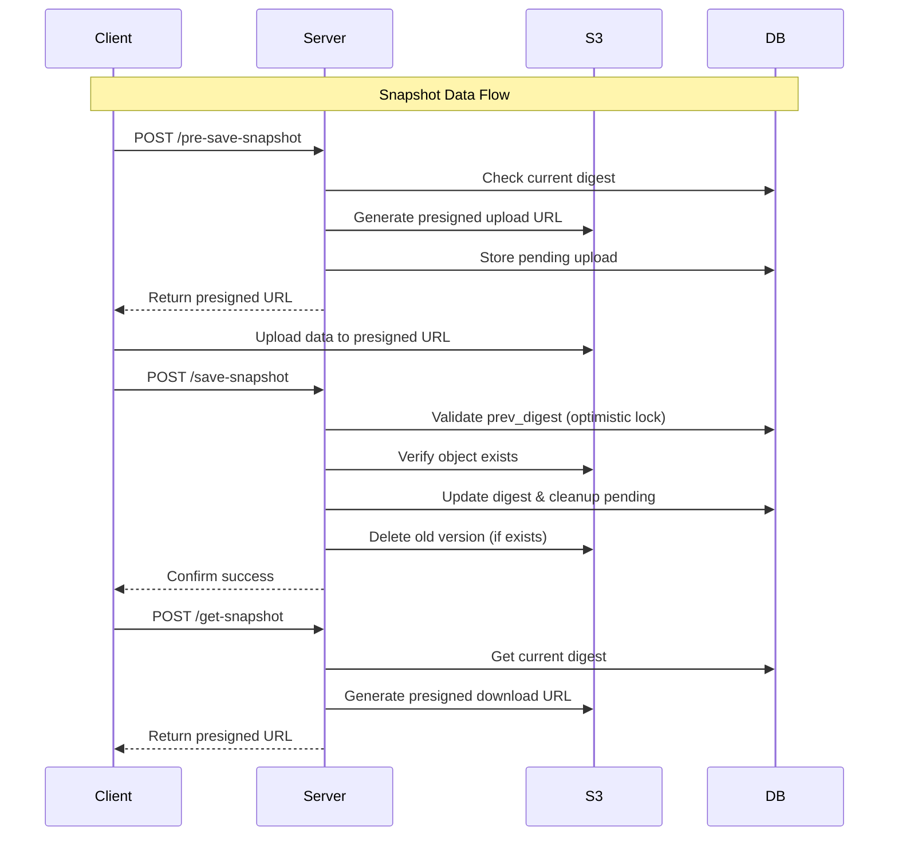
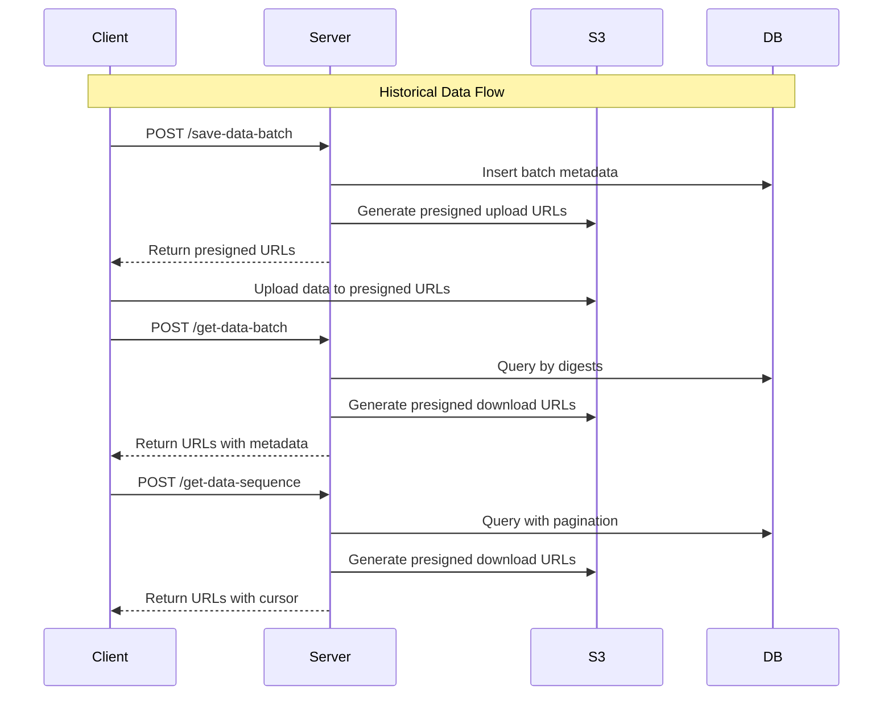
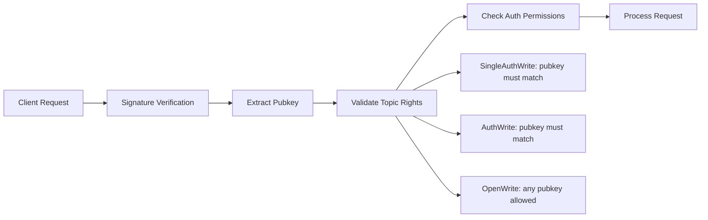

# Store Vault Server

Store-vault-server is a data storage service for the INTMAX2 protocol. It provides secure data backup, retrieval, and transfer capabilities between users through a stateless, self-custody architecture.

## Architecture Overview

Store-vault-server serves two primary roles:

1. **User Data Storage & Retrieval**: Users can store their own state data as backups and retrieve them when needed
2. **Inter-User Data Transfer**: Acts as a mailbox for users to send data to other users

### Data Types

#### Snapshot Data
- **Purpose**: Single-file updates with state management
- **Control**: Uses optimistic locking for conflict resolution
- **Characteristics**: 
  - One record per user per topic
  - Updates replace previous versions
  - Atomic operations with rollback support

#### Historical Data  
- **Purpose**: Append-only data storage
- **Control**: No locking mechanism (append-only)
- **Characteristics**:
  - Immutable once stored
  - Time-ordered sequence
  - Batch operations supported

### Data Storage Architecture

All data follows the path structure: `{topic}/{pubkey}/{digest}`

- **pubkey**: User identifier (top-level partition)
- **topic**: Data type/category classifier  
- **digest**: Content hash (unique file identifier)

### API Endpoints

#### Snapshot Data APIs



#### Historical Data APIs



### Database Schema

#### Snapshot Data Tables
```sql
-- Main snapshot storage
s3_snapshot_data (
    pubkey VARCHAR(66),
    topic VARCHAR(255), 
    digest VARCHAR(66),
    timestamp BIGINT,
    UNIQUE(pubkey, topic)
)

-- Pending upload tracking
s3_snapshot_pending_uploads (
    digest VARCHAR(66) PRIMARY KEY,
    pubkey VARCHAR(66),
    topic VARCHAR(255),
    timestamp BIGINT
)
```

#### Historical Data Table
```sql
s3_historical_data (
    digest VARCHAR(66) PRIMARY KEY,
    pubkey VARCHAR(66),
    topic VARCHAR(255), 
    upload_finished BOOLEAN,
    timestamp BIGINT
)
```

### Security & Access Control

#### Permission Types
- **SingleAuthWrite/SingleOpenWrite**: Single-state writes (snapshots)
- **AuthWrite/OpenWrite**: Historical data writes  
- **AuthRead/OpenRead**: Read permissions

#### Authentication Flow


### Cleanup & Maintenance

The server runs background processes for:

- **Historical Data Cleanup**: Validates S3 object existence and removes timed-out uploads
- **Snapshot Cleanup**: Removes dangling pending uploads after timeout
- **Consistency Checks**: Ensures database-S3 synchronization

### Error Handling

- **Lock Errors**: Optimistic lock failures on snapshot updates
- **Timeout Errors**: Upload timeouts and cleanup
- **Validation Errors**: Permission and data integrity checks
- **Storage Errors**: S3 operation failures

## Configuration

This application requires specific AWS and CloudFront configurations. Follow the steps below to set up your environment properly.

## Environment Variables

Create a `.env` file in your project root and set the following variables:

### CloudFront Configuration

```bash
CLOUDFRONT_KEY_PAIR_ID=your_key_pair_id
CLOUDFRONT_PRIVATE_KEY_BASE64=your_base64_encoded_private_key
BUCKET_NAME=your_s3_bucket_name
CLOUDFRONT_DOMAIN=your_cloudfront_domain
```

### AWS Configuration

```bash
AWS_REGION=your_aws_region
AWS_ACCESS_KEY_ID=your_access_key_id
AWS_SECRET_ACCESS_KEY=your_secret_access_key
```

## Setup Instructions

### 1. CloudFront Key Pair

* **Generate RSA Keys:**

  ```bash
  # Generate a private RSA key
  openssl genrsa -out private_key.pem 2048

  # Generate the public key from the private key
  openssl rsa -pubout -in private_key.pem -out public_key.pem

  # Encode private key to Base64
  base64 -i private_key.pem | tr -d '\n'
  ```

* **Create CloudFront Key Pair:**

  1. Visit AWS CloudFront console → **Key management** → **Key pairs**.
  2. Generate and download your private key file.

* **Set Key Pair ID:**

  * Copy and set the `CLOUDFRONT_KEY_PAIR_ID`.

* **Encode Private Key:**

  ```bash
  base64 -i your-private-key.pem | tr -d '\n'
  ```

  Set this Base64 result to `CLOUDFRONT_PRIVATE_KEY_BASE64`.

### 2. S3 Bucket

* Ensure an S3 bucket exists. Set its name (without `s3://`) to `BUCKET_NAME`.

### 3. CloudFront Domain

* Create a CloudFront distribution pointing to your S3 bucket.
* Copy the domain name (e.g., `d1234567890.cloudfront.net`) and set it to `CLOUDFRONT_DOMAIN` (without `https://`).

### 4. AWS Credentials

* **IAM User Setup (Recommended):**

  1. Create an IAM user with required S3 and CloudFront permissions.
  2. Generate AWS access keys for this user.

* **Configure AWS:**

  * Set your AWS region (`AWS_REGION`).
  * Add your AWS credentials (`AWS_ACCESS_KEY_ID`, `AWS_SECRET_ACCESS_KEY`).

## Required IAM Permissions

Ensure your IAM user has these permissions:

```json
{
    "Version": "2012-10-17",
    "Statement": [
        {
            "Effect": "Allow",
            "Action": [
                "s3:GetObject",
                "s3:PutObject",
                "s3:DeleteObject",
                "s3:ListBucket"
            ],
            "Resource": [
                "arn:aws:s3:::your-bucket-name",
                "arn:aws:s3:::your-bucket-name/*"
            ]
        },
        {
            "Effect": "Allow",
            "Action": [
                "cloudfront:CreateInvalidation"
            ],
            "Resource": "*"
        }
    ]
}
```


