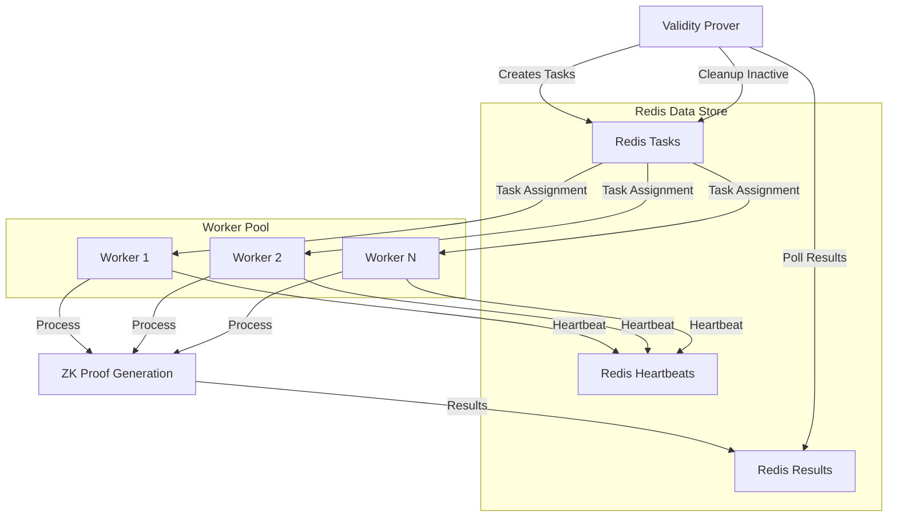
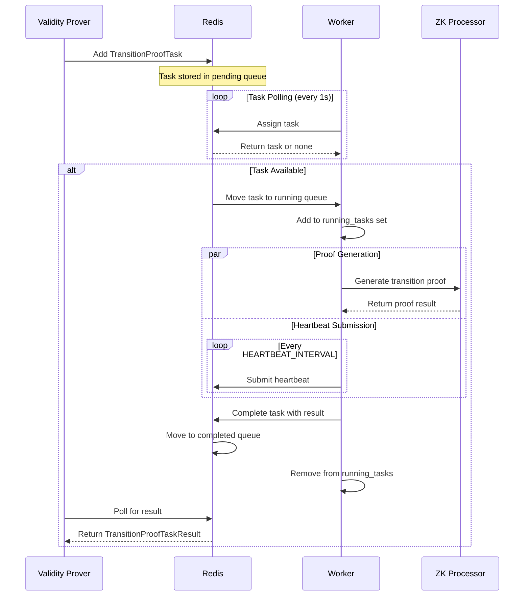

# Validity Prover Worker

## Overview

The Validity Prover Worker is a distributed worker service that processes transition proof generation tasks created by the Validity Prover. Multiple worker instances can be deployed to enable parallel processing and improve throughput for proof generation.

The worker continuously polls Redis for pending transition proof tasks, processes them using the ValidityTransitionProcessor, and stores the results back to Redis. Each worker can handle multiple tasks concurrently based on the configured `NUM_PROCESS` parameter.

## Architecture

### Components

- **Worker**: Main service that manages task polling, processing, and heartbeat submission
- **ValidityTransitionProcessor**: ZK proof generation engine for validity transitions
- **TaskManager**: Redis-based task queue management system
- **Heartbeat System**: Ensures task reliability and handles worker failures

### Key Features

- **Horizontal Scaling**: Deploy multiple worker instances for increased throughput
- **Fault Tolerance**: Heartbeat mechanism detects failed workers and reassigns tasks
- **Concurrent Processing**: Each worker can process multiple tasks simultaneously
- **Task Persistence**: All tasks and results are stored in Redis with configurable TTL

## Configuration

### Environment Variables

| Variable             | Description                              | Default                  | Required |
| -------------------- | ---------------------------------------- | ------------------------ | -------- |
| `REDIS_URL`          | Redis connection URL                     | `redis://localhost:6379` | Yes      |
| `TASK_TTL`           | Task time-to-live in seconds             | `86400` (24 hours)       | Yes      |
| `HEARTBEAT_INTERVAL` | Heartbeat submission interval in seconds | `10`                     | Yes      |
| `NUM_PROCESS`        | Number of concurrent tasks per worker    | `2`                      | Yes      |

### Example Configuration

```bash
ENV="local"
TASK_TTL=86400
HEARTBEAT_INTERVAL=10
REDIS_URL="redis://localhost:6379"
NUM_PROCESS=2
```

## Redis Data Structures

The worker interacts with several Redis data structures managed by the TaskManager:

### 1. Task Hash

- **Key**: `validity_prover:tasks`
- **Type**: HSET
- **Purpose**: Stores serialized `TransitionProofTask` objects
- **Field**: `{block_number}` (task ID)
- **Value**: JSON serialized task data
- **TTL**: Configurable via `TASK_TTL`

### 2. Task Queues

- **Pending Tasks**: `validity_prover:tasks:pending` (SET)
- **Running Tasks**: `validity_prover:tasks:running` (SET)
- **Completed Tasks**: `validity_prover:tasks:completed` (SET)
- **Members**: Block numbers (task IDs)

### 3. Results Hash

- **Key**: `validity_prover:results`
- **Type**: HSET
- **Purpose**: Stores serialized `TransitionProofTaskResult` objects
- **Field**: `{block_number}` (task ID)
- **Value**: JSON serialized result data

### 4. Worker Heartbeats

- **Key**: `validity_prover:heartbeat:{block_number}`
- **Type**: STRING
- **Value**: Worker ID (UUID)
- **TTL**: `HEARTBEAT_INTERVAL * 3`

## Data Flow



## Task Processing Flow



## Task Data Structures

### TransitionProofTask

```rust
pub struct TransitionProofTask {
    pub block_number: u32,
    pub prev_validity_pis: ValidityPublicInputs,
    pub validity_witness: ValidityWitness,
}
```

### TransitionProofTaskResult

```rust
pub struct TransitionProofTaskResult {
    pub block_number: u32,
    pub proof: Option<ProofWithPublicInputs<F, C, D>>,
    pub error: Option<String>,
}
```

## Fault Tolerance

### Heartbeat Mechanism

- Workers submit heartbeats every `HEARTBEAT_INTERVAL` seconds for active tasks
- Heartbeats have TTL of `HEARTBEAT_INTERVAL * 3`
- Missing heartbeats indicate worker failure

### Task Recovery

- Inactive tasks (no heartbeat) are moved back to pending queue
- Only tasks without results are reassigned
- Prevents duplicate processing of completed tasks
